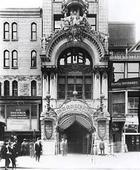
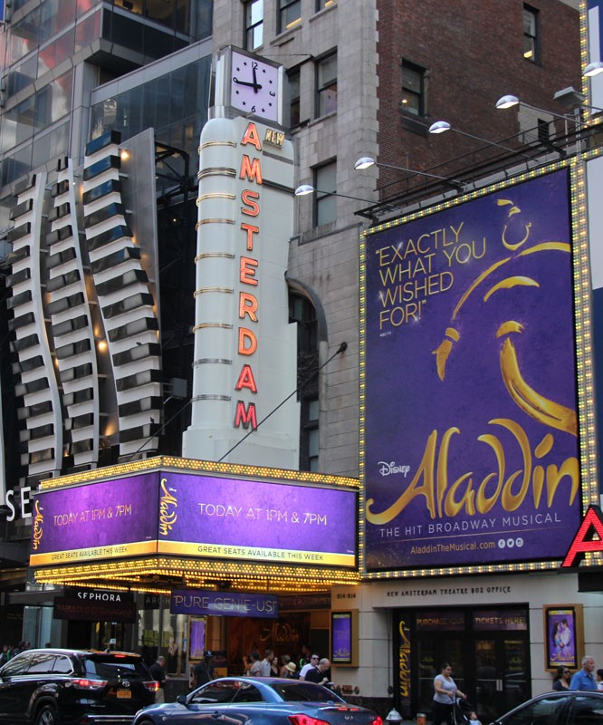
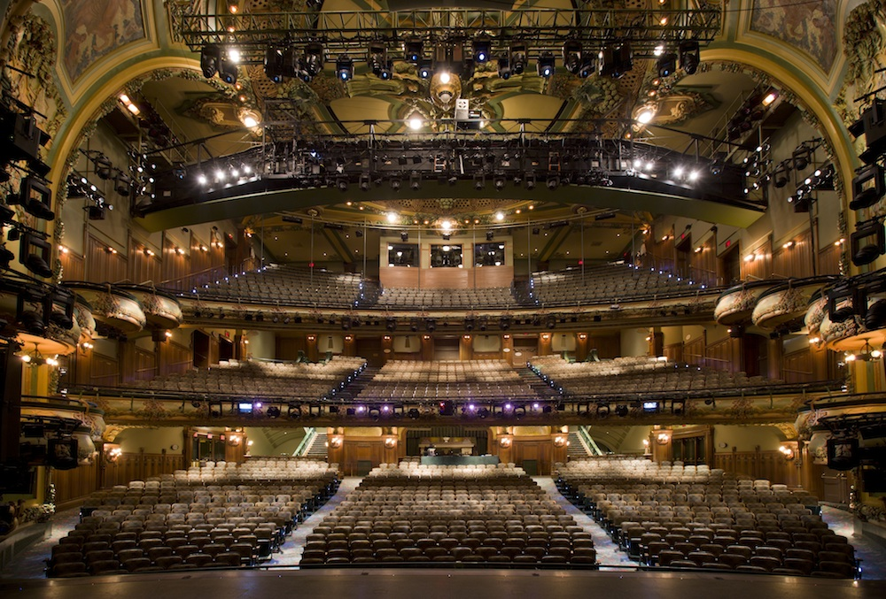

# abby-press
halloween poster
<!DOCTYPE html>

<!-- Abby Press
		web page project 
		spooky vacations 
		october 13, 2017 -->
		
	<html>
		
		<head> 
			
			<title> Panada travel agency New Amsterdam theatre new York </title> 
			
		</head> 
		
		

		
		<body bgcolor="darkorange" text="black" > 
		
		<h1 id="top"> New Amsterdam Theatre New York, New York </h1>
	
		

		
		<i> <blockquote> Welcome to New Amsterdam's Haunted Theatre! </blockquote> </i>
	
	<!-- this is the paragraph abput the theatre. it tells how it is haunted and what it
	is used for --> 
	
	
  New Amsterdam Theatre is currently preforming Aladdin at the time! While watching
	 Aladdin you may see a little something running across stage. Thats Olive Thomas 
	 who died in 1920, and haunts the theatre to this day! Sometimes she is seen
	  gliding across stage blowing kisses to the audience. 	New Amsterdam theatre is also
	  broadways home for disney shows/musicals. Another perk of the theatre is that you 
	  can rent out the theatre for events. 
 
	
	<!-- These are just some pictures! --> 
	
	<figure> 
	
	<figcaption> This is what the old New Amsterdam   theatre looked like before it was 
	remolded. </figcaption> 
	</figure>	
	<figure>	
	 
	 <figcaption> This is what the new and remolded theatre looks like. </figcaption> 
	</figure>	 
	<figure>	
	  
	 <figcaption> This is what the inside of the theatre looks like, this   is what the 
	 ghost would see if she was standing on stage! </figcaption> 
	</figure>
	
	<!-- Here are some review that I made up. --> 
	
	 
 <b> <h2> Reviews </b> </h2> 
 
	
	
	
 <i> <blockquote> I saw Aladdin, last night and the New Amsterdam Theatre had a
	great atmosphere, and did a wonderful job preforming!  </i> </blockquote> Submitted 
	by: Colleen 
	 <i> <blockquote> Last night I went to the theatre with my family to see Aladdin, and 
	 my son pointed out to me the ghost running back and forth on the stage during 
	 intermission! We did not believe that it was haunted until this! Just another 
	 awesome thing about this theatre. </i> </blockquote>  Submitted by: Mat 

	
	<!-- Here are some fun places to go while in New York when your around the theatre --> 
	
	
 <b>  <h2> Places to go around the theater </b> </h2> 
 
	
		<ul> 
	
	<li> <a href="https://ripleysnewyork.com/" </a> Ripleys Believe it or not! If you
	 just want to go out and have fun! </li> 
	
	<li> <a href="https://www.tripadvisor.com/Restaurant_Review-g60763-d423807-Reviews
	-Aureole-New_York_City_New_York.html" </a> 
	Areole, is a good restaurant to go to if you feel like a nice dinner! </li>
	
	<li> <a href="https://www.tripadvisor.com/Restaurant_Review-g60763-d4341828-
	Reviews-Starbucks-New_York_City_New_York.html" </a> 
	Everyone wants a little Starbucks sometimes, and it just so happens their is one just
	 a few steps away! </li> 
		
		</ul>
		
		 <a href="mailto:info@pandatravel.org"> Contact us at the Panda Travel 
		Agency! </a>  
  Click the link for email, or use this number! (555-905-1982)
 
		
		
		
		
